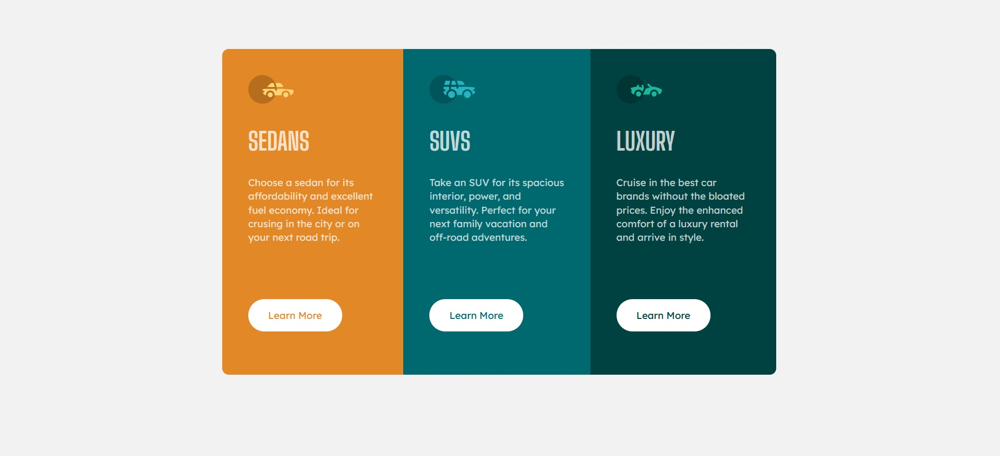

# Frontend Mentor - 3-column preview card component solution

Esta es una solución al [3-column preview card component challenge on Frontend Mentor](https://www.frontendmentor.io/challenges/3column-preview-card-component-pH92eAR2-). Los desafíos de Frontend Mentor lo ayudan a mejorar sus habilidades de codificación mediante la construcción de proyectos realistas. 

## Tabla de Contenido

- [Descripción general ](#descripción-general)
  - [El reto](#el-reto)
  - [Captura de pantalla ](#captura)
  - [Enlaces](#enlaces)
- [Mi proceso](#Mi-proceso)
  - [Construido con](#construido-con)
  - [Que aprendí](#que-aprendí)
  - [Desarrollo continuo](#desarrollo-continuo)
  - [Recursos útiles](#recursos-útiles)
- [Autor](#autor)

## Descripción general 

### El reto

Los usuarios deben poder: 

- Ver el diseño óptimo según el tamaño de la pantalla de su dispositivo
- Ver estados de desplazamiento para elementos interactivos 

### Screenshot

### Enlaces

- Solucion URL: [GitHub](https://your-solution-url.com)
- Sitio web subido URL: [Netlify](https://your-live-site-url.com)

## Mi proceso

### Construido con 

- HTML
- CSS
- Flexbox

### Que aprendí

Dentro de todo este desafio fue encarado con facilidad, no hubo un nuevo aprendizaje pero si un refuerzo de mis conocimientos

### Desarrollo continuo

Seguir mejorando en cuanto al tiempo que me lleva hacer este tipo de proyectos, el mejorar la semantica HTML y CSS para serlo mas legible y poder dar mejores respuestas con un codigo mas legible y ordenado

### Recursos útiles

- [w3schools](https://www.w3schools.com/) - La vieja y confiable, ya que no recordaba algunas cosas en espeficico
- [StackOverflow](https://stackoverflow.com/) - este es un recurso asombroso. Pude hacer algunas preguntas y obtener comentarios positivos.

## Autor

- Website - [Add your name here](https://www.your-site.com) (próximamente)
- Frontend Mentor - [@Sergio Moreno](https://www.frontendmentor.io/profile/SergioMMoreno)
- Twitter - [@SoySergio](https://twitter.com/SoyNeroo)
